# Project 1: Analyzing DNS, TCP, HTTP, and TLS Traffic with Wireshark

This repository documents the practical packet-level analysis of foundational network protocols. Using Wireshark, the objective is to capture, filter, and inspect the mechanics of domain resolution, connection establishment, plaintext web requests, and encrypted sessions across 21 specific analytical tasks.

---

### 1. DNS Traffic Analysis (Tasks 1 - 4)
**Concepts applied:** Domain resolution, A/AAAA records, and DNS querying.

<b>📸 View DNS Screenshots (Tasks 1-4)</b>

 

**Task 1:** Capture DNS Traffic
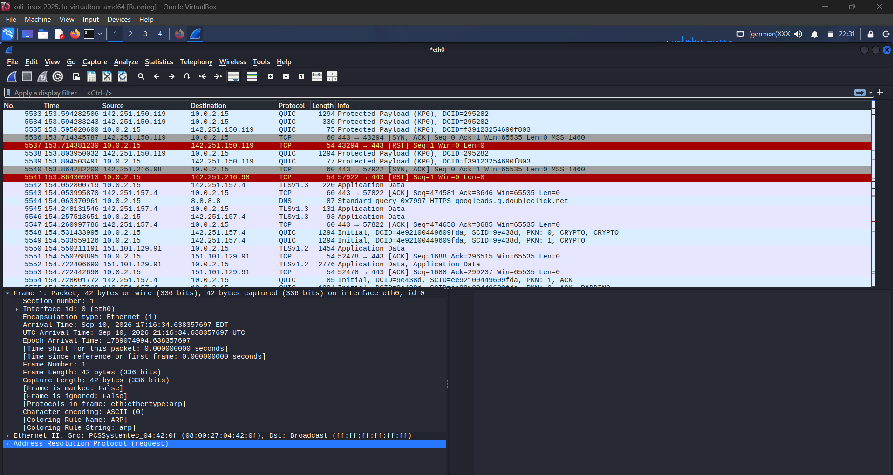

**Task 2:** Filter DNS Traffic
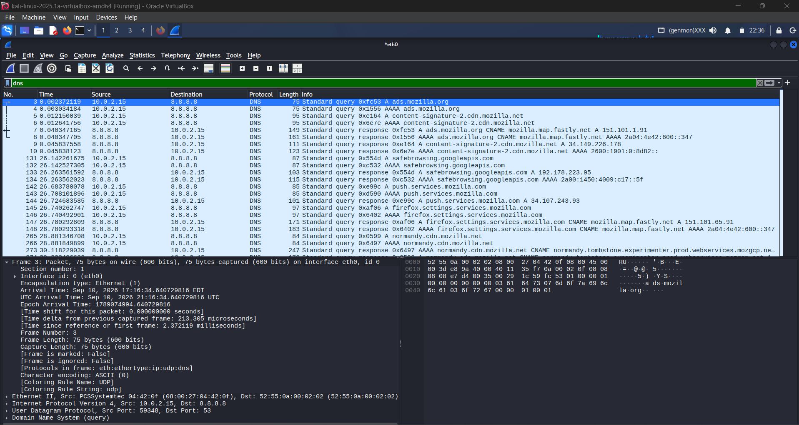

**Task 3:** Analyze DNS Requests
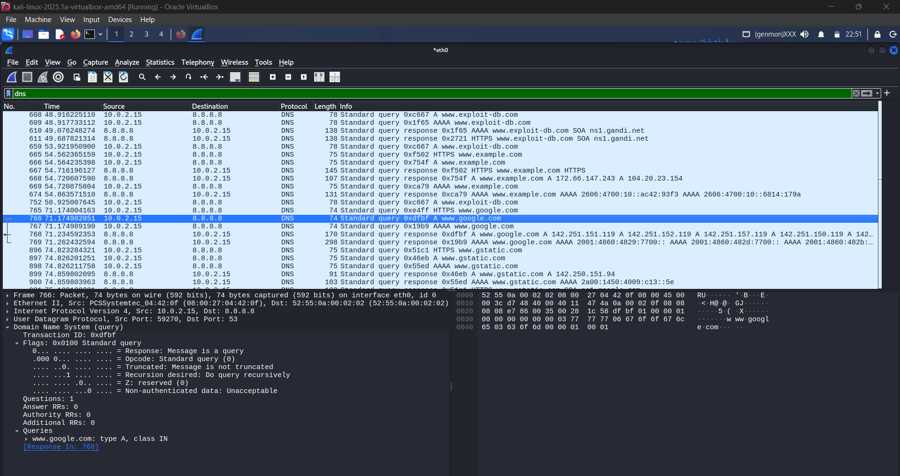

**Task 4:** Analyze DNS Responses
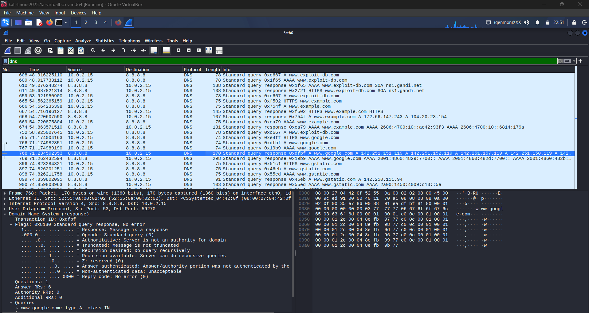

---

### 2. TCP Traffic Analysis (Tasks 5 - 8)
**Concepts applied:** Reliable transport, sequence numbers, the 3-Way Handshake, and connection teardown.

<b>📸 View TCP Screenshots (Tasks 5-8)</b>

 

**Task 5:** Capture TCP Traffic

**Task 6:** Filter TCP Traffic
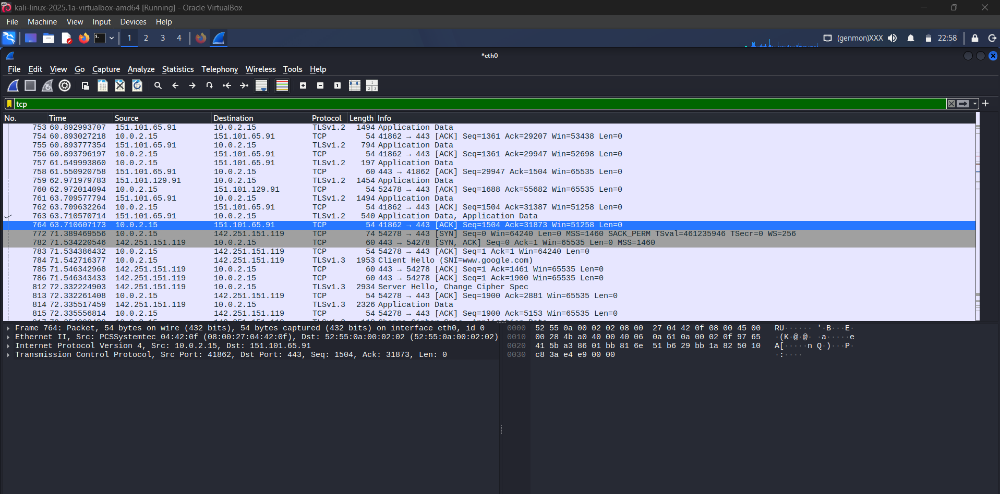

**Task 7:** Analyze the TCP 3-Way Handshake
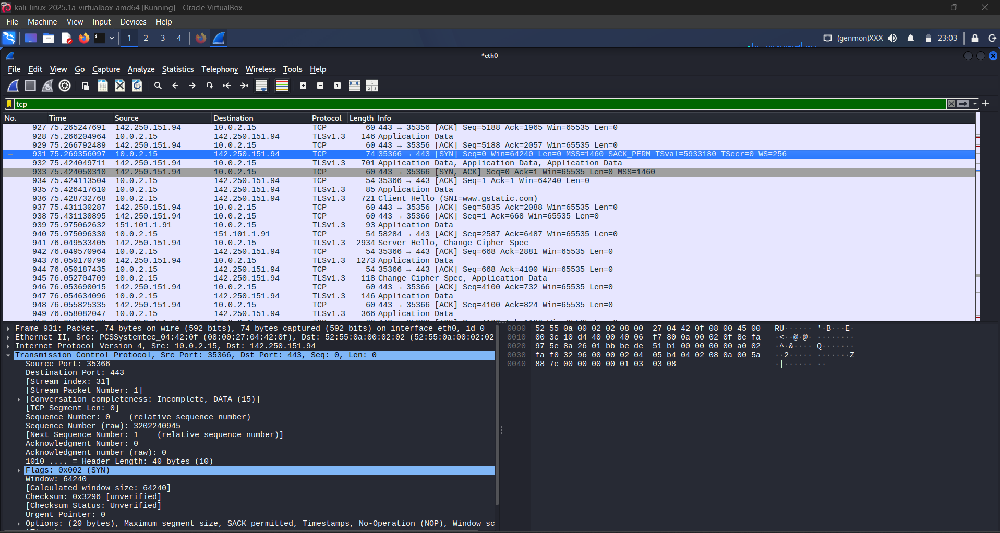

**Task 8:** Analyze TCP Teardown
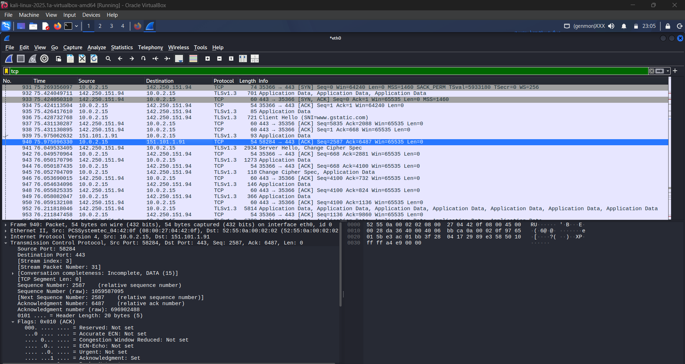

---

### 3. HTTP Traffic Analysis (Tasks 9 - 12)
**Concepts applied:** Plaintext application layer traffic, HTTP methods, and status codes.

<b>📸 View HTTP Screenshots (Tasks 9-12)</b>

 

**Task 9:** Capture HTTP Traffic
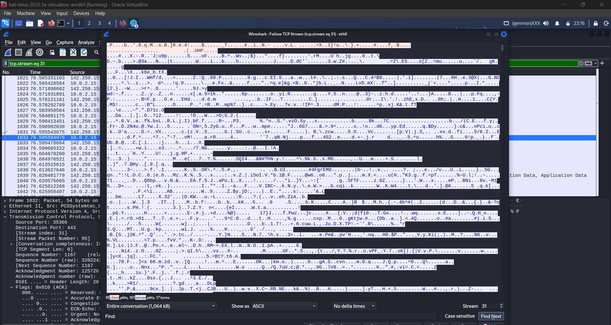

**Task 10:** Filter HTTP Traffic
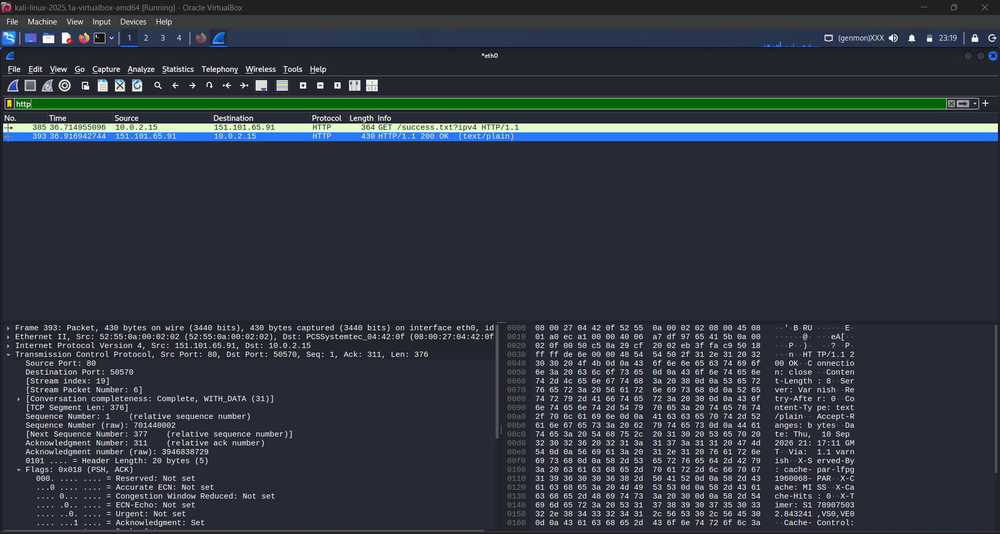

**Task 11:** Analyze HTTP Request
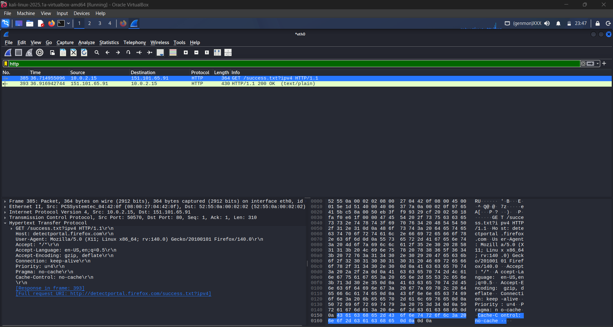

**Task 12:** Analyze HTTP Response
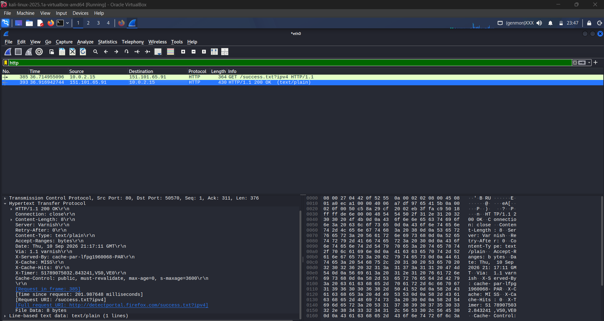

---

### 4. TLS Traffic Analysis (Tasks 13 - 21)
**Concepts applied:** Secure communication, cipher suite negotiation, key exchanges, and encrypted payloads.

<b>📸 View TLS Screenshots (Tasks 13-21)</b>

 

**Task 13:** Capture TLS Traffic

**Task 14:** Filter TLS Traffic
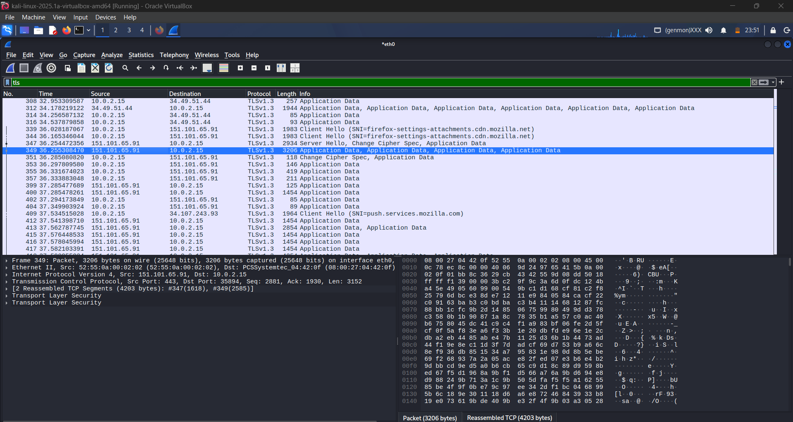

**Task 15:** Analyze TLS Handshake (Client Hello)
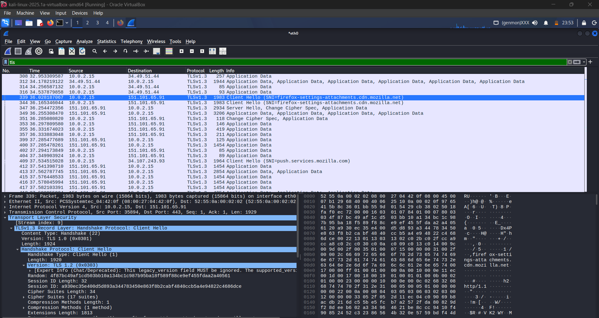

**Task 16:** Analyze TLS Handshake (Server Hello)
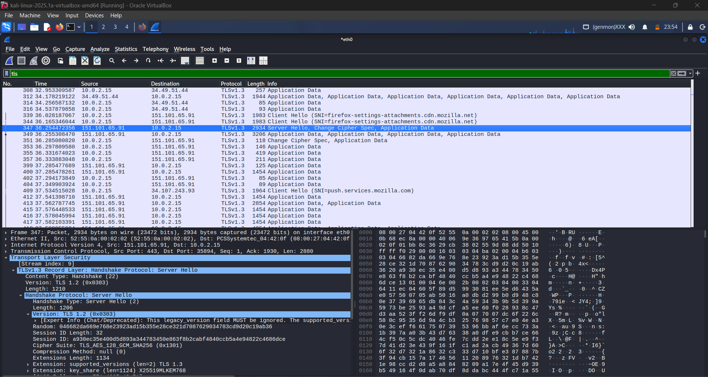

**Task 17:** Analyze TLS Certificate
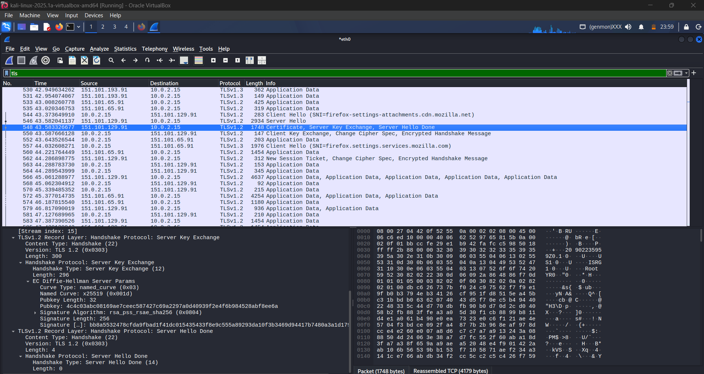

**Task 18:** Analyze TLS Server Key Exchange

**Task 19:** Analyze TLS Client Key Exchange

**Task 20:** Analyze TLS Change Cipher Spec

**Task 21:** Observe Encrypted Application Data
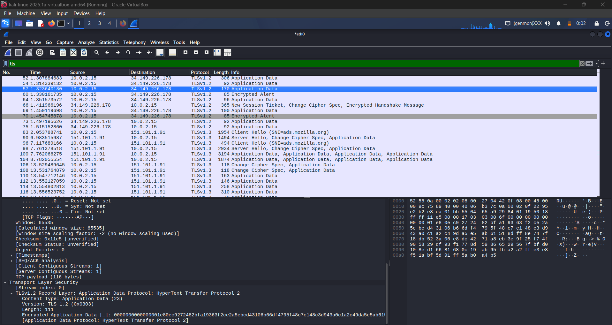

